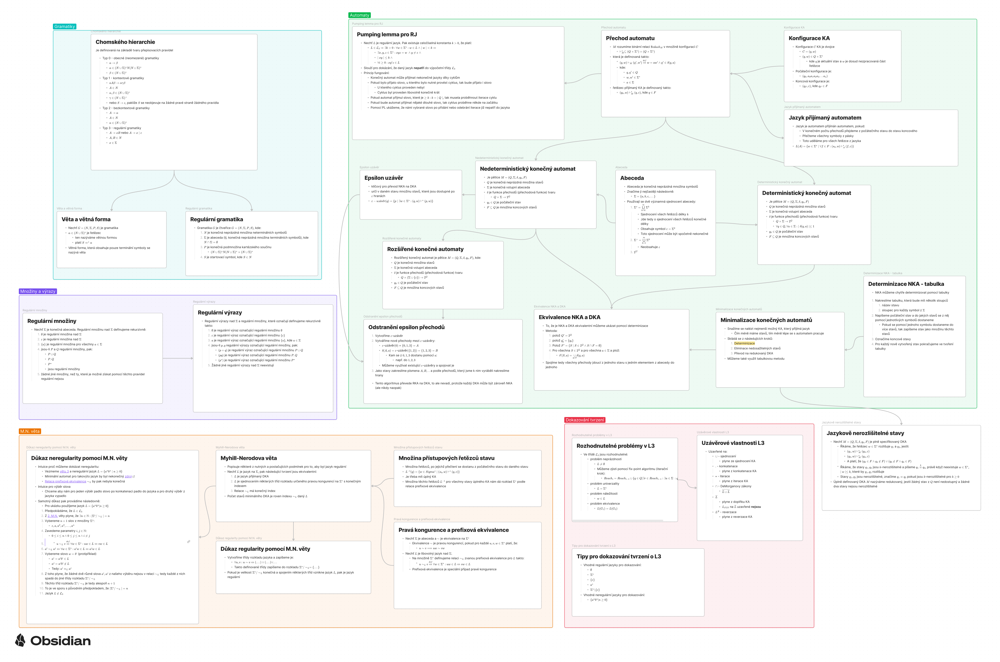
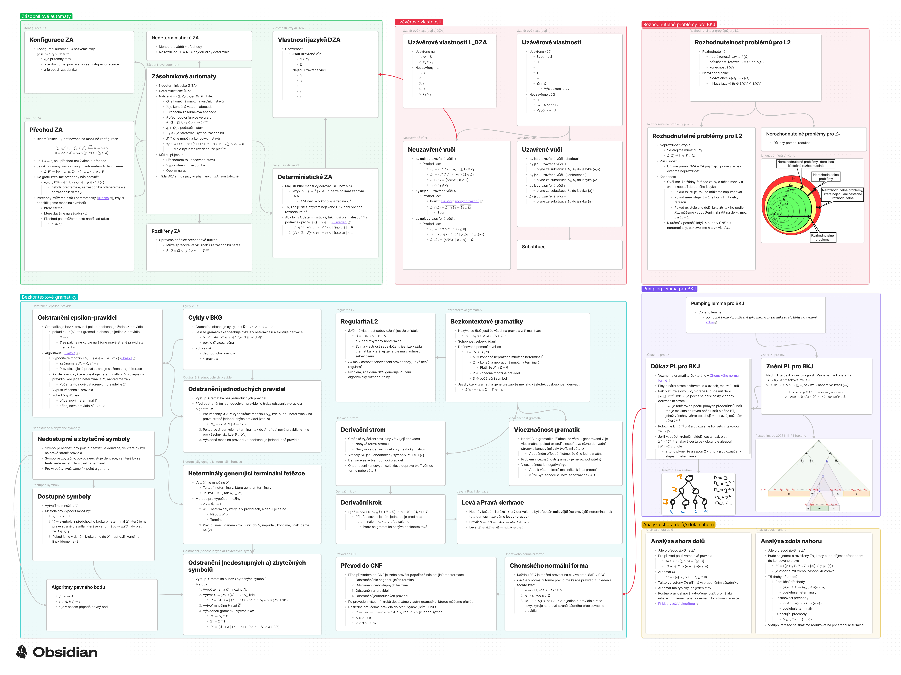
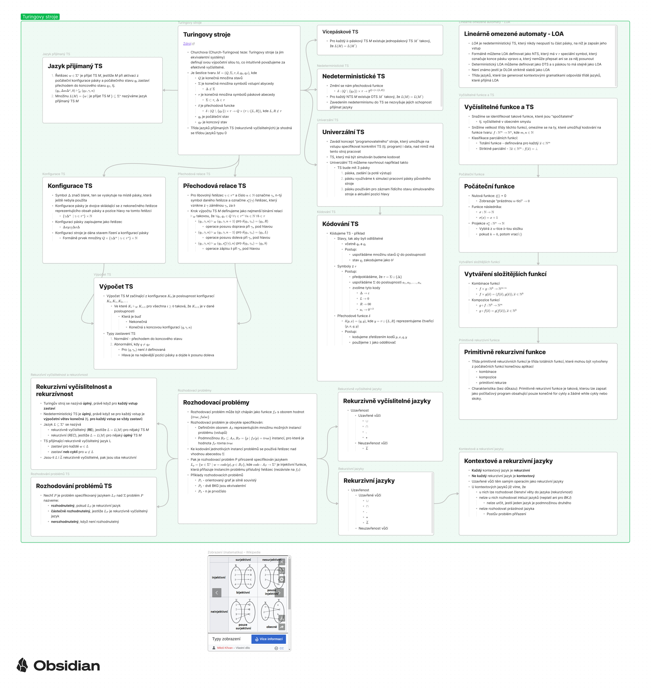
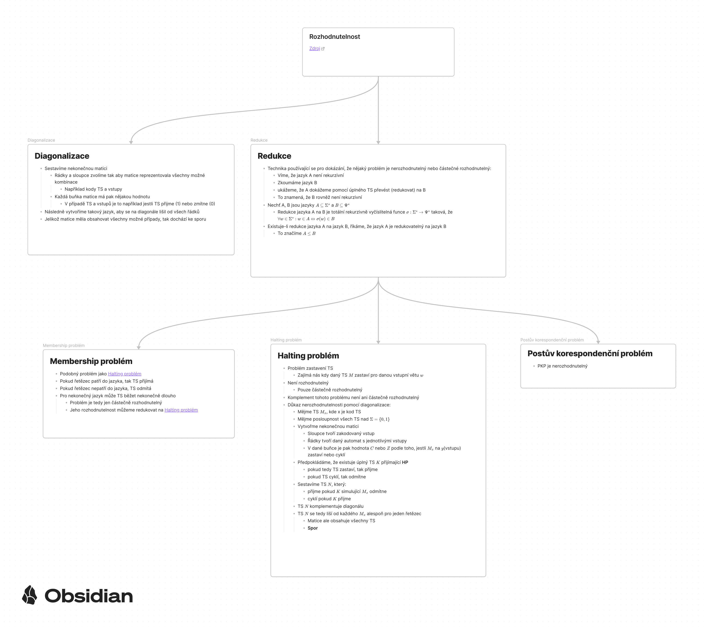
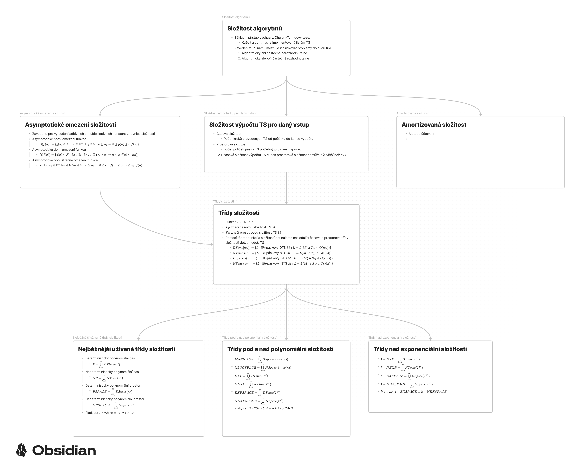

# TIN poznámky v grafech

Poznámky jsou psané v aplikaci [Obsidian](https://obsidian.md/), která podporuje LaTeX.

Pokud chcete něco opravit nebo doplnit, vytvořte pull request!

## Regulární jazyky

## Bezkontextové jazyky

## Turingovy stroje

## Rozhodnutelnost

## Složitost

